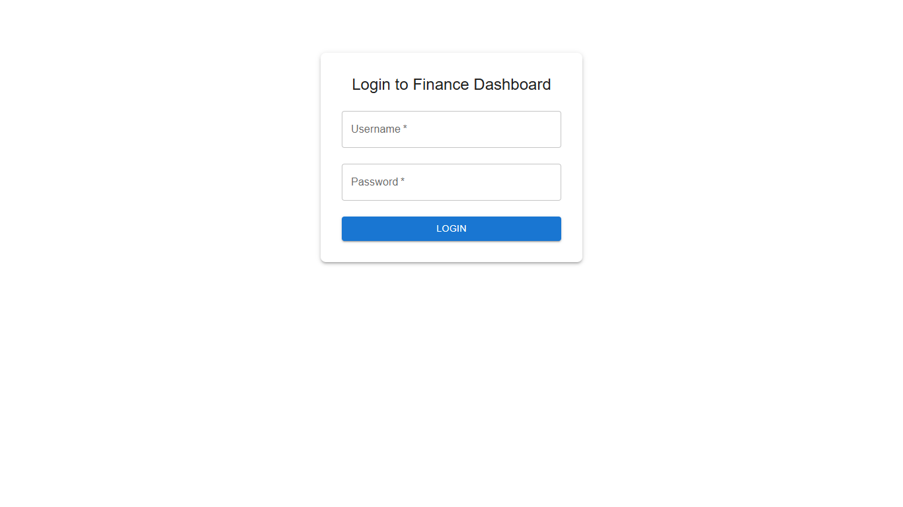
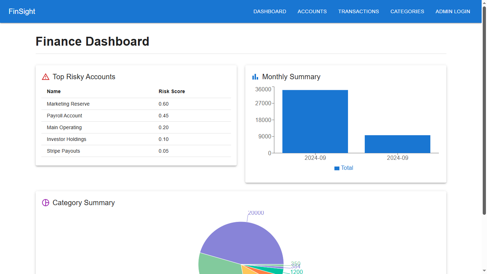
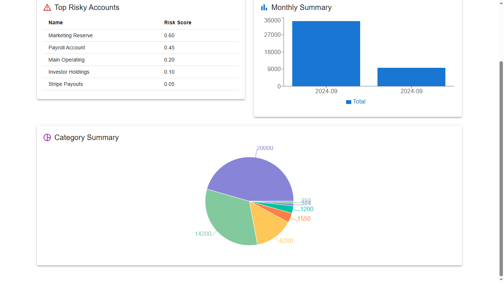
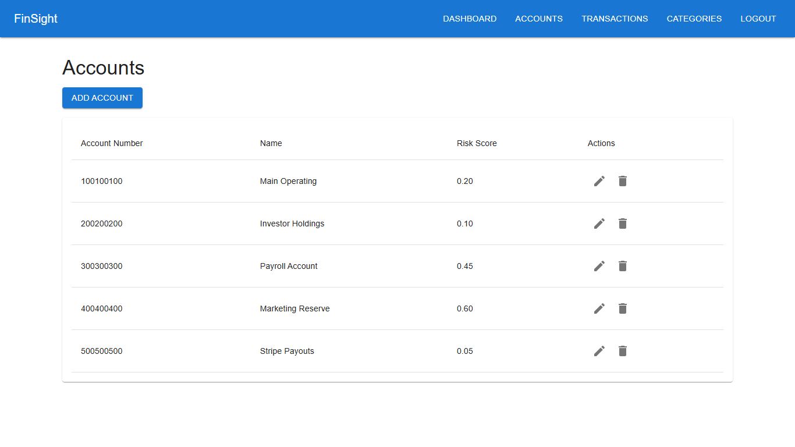
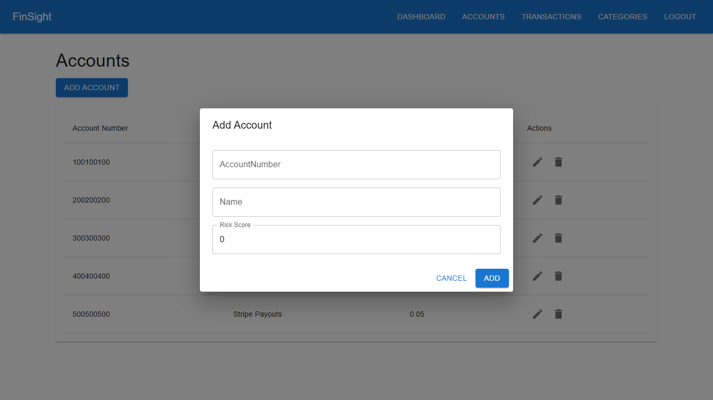
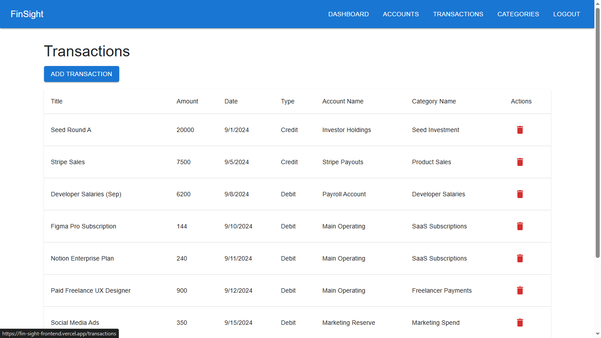
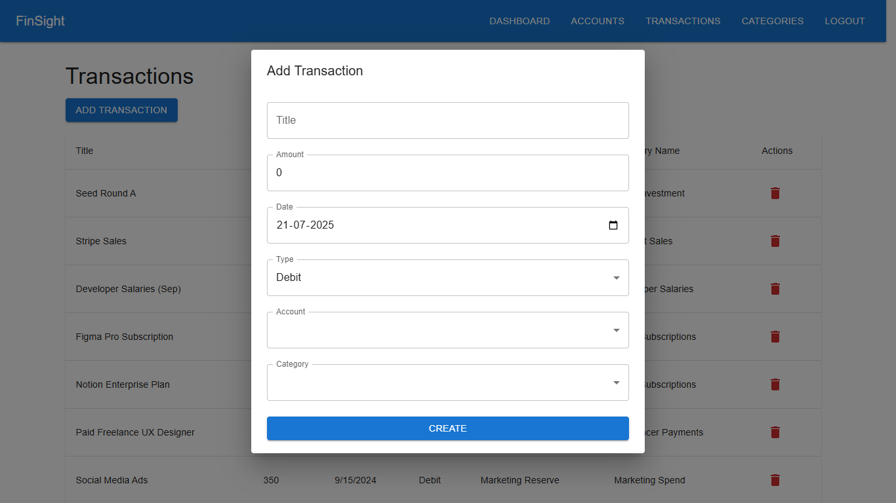
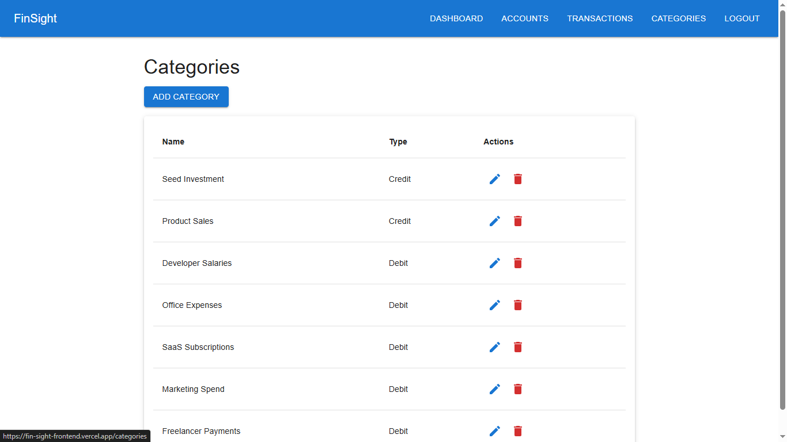
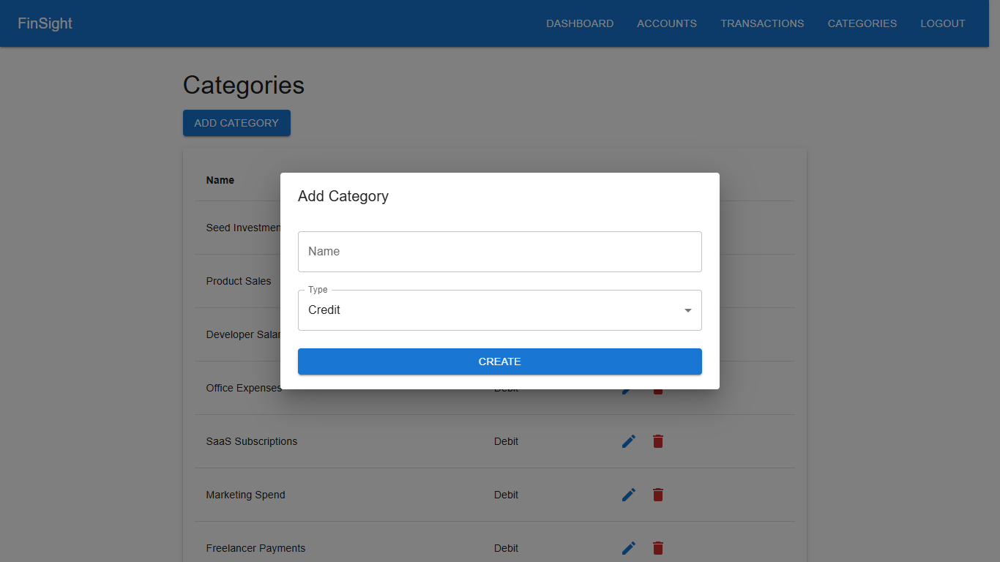

# 📊 FinanceDashboard API

A secure and scalable financial analytics backend built with **ASP.NET Core 8** and **PostgreSQL**, featuring **JWT authentication**, **role-based access**, and clean RESTful APIs for accounts, transactions, and categories.

> 🔧 **Status**: In Progress — actively developing analytics endpoints and frontend integration.

---

### 🖼️ Screenshots

#### Login Page



#### Dashboard View




#### Accounts View




#### Transactions View




#### Categories View




## 🚀 Tech Stack

- **Backend**: ASP.NET Core 8 Web API
- **Database**: PostgreSQL + Entity Framework Core
- **Authentication**: JWT (JSON Web Token)
- **Authorization**: Role-based (Admin / Analyst)
- **Testing & Docs**: Swagger UI

---

## 🧠 Features

- 🔐 **User registration & login** with JWT token generation
- 👤 **Role-based authorization** using `[Authorize]` and custom policies
- 📁 Full **CRUD APIs** for:
  - Accounts
  - Transactions
  - Categories
- 🧾 Each transaction linked to an account and category
- 📊 Ready for advanced analytics (Top N, category totals, trends)
- 🧱 Layered architecture with:
  - DTOs
  - Services
  - Controllers
  - Clean separation of concerns

---

## 🔐 Roles & Permissions

| Endpoint                 | Admin       | Analyst     |
|--------------------------|-------------|-------------|
| `/api/auth/*`            | ✅ Register | ✅ Login     |
| `/api/account/*`         | ✅ Full     | 🔍 Read-only |
| `/api/transaction/*`     | ✅ Full     | ✅ C/U/R     |
| `/api/category/*`        | ✅ Full     | 🔍 Read-only |
| `/api/analytics/*`       | ✅ Yes      | ✅ Yes       |

---

## 📦 Getting Started

```bash
git clone https://github.com/yourusername/FinanceDashboard.git
cd FinanceDashboard
dotnet restore
dotnet ef database update
dotnet run
```

### Open in browser:

https://localhost:5001/swagger

### 🛠 Setup Requirements
- .NET 8 SDK
- PostgreSQL
- pgAdmin for GUI-based DB management

### 👤 Author
Abhishek Khadgi  
🔗 [LinkedIn](https://www.linkedin.com/in/abhikhadgi/)

### 📜 License
MIT — free to use and modify.